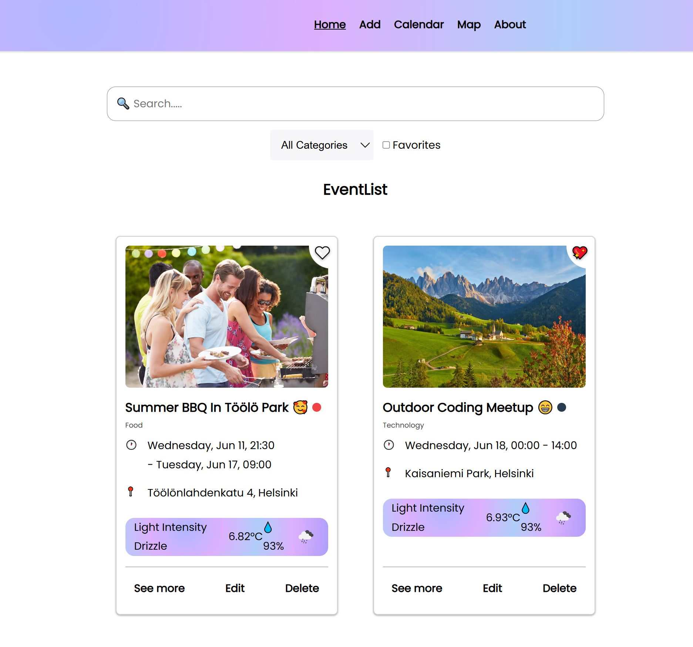
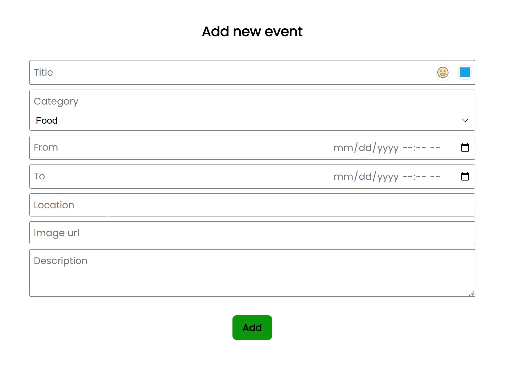
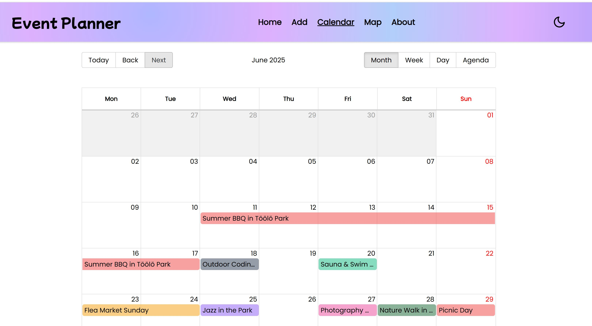
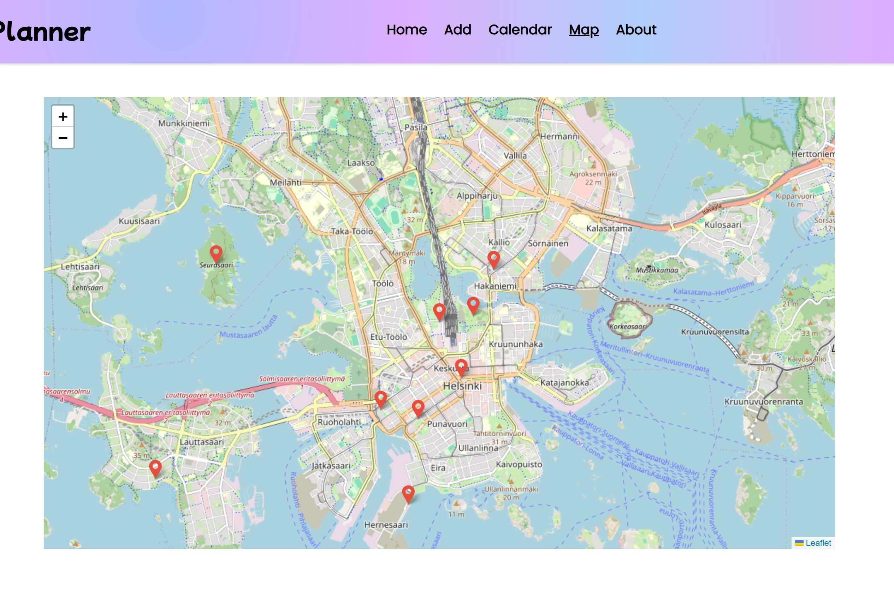
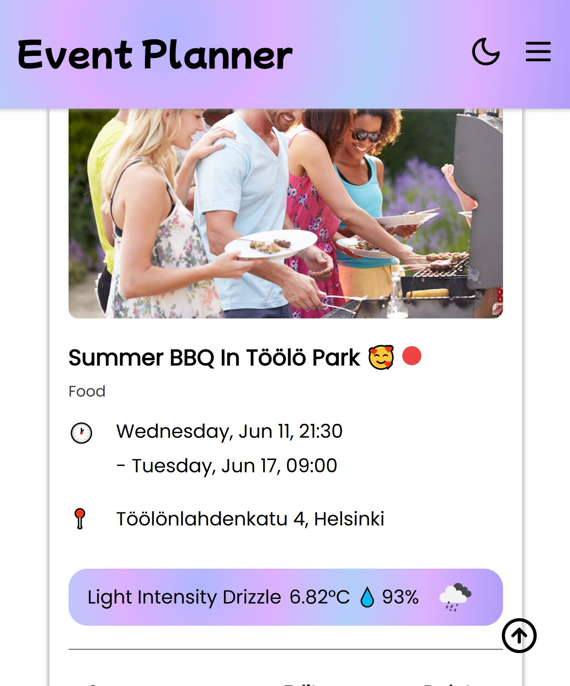

# 🎯 Event Planner Application

This is a simple event planner app that allows users to create, view, and manage personal events. It was built using React and deployed via Render (backend) and Vercel (frontend).

## 📝 Purpose

This project was created as part of a web development learning journey to practice building full-stack React applications.

## 🚀 Getting started

1.  ### Clone the repository

    ```bash
    git clone https://github.com/Hoa28686/event-planner.git
    cd event-planner/frontend
    ```

2.  ### Install the dependencies

    ```bash
    npm install
    ```

3.  ### Set up environment variables

    Create `.env` in the frontend root folder of this project and add your API keys

    ```bash
    VITE_WEATHER_API_KEY=your_open_weather_api_key
    VITE_OPENCAGE_API_KEY=your_opencage_api_key
    VITE_LOCATIONIQ_API_KEY=your_locationIQ_api_key
    ```

4.  ### Start the development server
    ```bash
    npm run dev
    ```

## 🔗 Links and Live Page

- [Frontend-Vercel](https://finnish-event-planner.vercel.app/)
- [Frontend-Netlify](https://comforting-croissant-0435fb.netlify.app/)

- [Backend (JSON Server API)](https://finnish-event-planner.onrender.com/events)

## ✨ Key Features

- 🗓️ Create, edit, and delete events with ease
- 🔍 Search events by title, location or description
- 🌦️ View current weather forecasts at each event location
- 🖼️ Upload image URLs to showcase events
- 🌗 Toggle between dark and light mode
- 🌍 Display all events on a calendar and map based on event time and location, respectively
- 📱 Responsive design for mobile devices

## 🛠️ Technologies Used

- React (with Hooks)
- React Router
- Axios (API calls)
- JSON Server (as a mock backend)
- Basic CSS and CSS Modules

## 📸 Screenshots

### Homepage



### Add Event Page



### Calendar



### Map View



### Mobile version

<p align="center">
  
</p>
